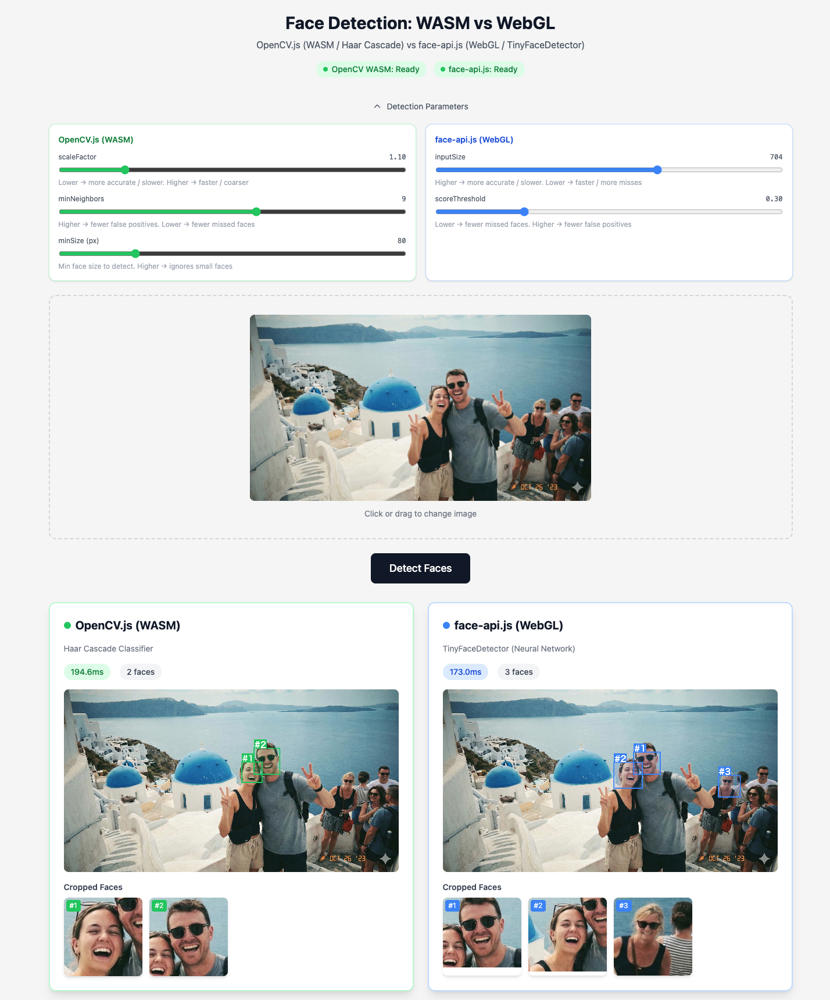

# wasm-face-recognition

A browser-based face detection app built with Next.js that compares two fundamentally different approaches to face detection — **OpenCV.js (WASM)** and **face-api.js (WebGL)** — running entirely client-side with no server-side processing.



## How It Works

Two face detection pipelines run in parallel on the same input image:

| Method | Engine | Algorithm | Runtime |
|--------|--------|-----------|---------|
| **OpenCV.js (WASM)** | OpenCV 4.9.0 compiled to WebAssembly | Haar Cascade Classifier | CPU (WASM) |
| **face-api.js (WebGL)** | TensorFlow.js + WebGL backend | TinyFaceDetector (CNN) | GPU (WebGL) |

### OpenCV.js — Haar Cascade (WASM)

OpenCV's Haar Cascade Classifier is a classical machine learning approach (Viola-Jones, 2001) that uses a cascade of weak classifiers trained on Haar-like features. The model is loaded as an XML file (`haarcascade_frontalface_default.xml`) into OpenCV's virtual filesystem (Emscripten FS).

**Pipeline:**
1. Load image at native resolution onto an off-screen canvas (avoids CSS scaling artifacts from `cv.imread`)
2. Convert RGBA → Grayscale (`cv.cvtColor`)
3. Apply histogram equalization (`cv.equalizeHist`) to normalize lighting
4. Run `detectMultiScale` with configurable `scaleFactor`, `minNeighbors`, and `minSize`
5. Return bounding boxes in natural image coordinates

**Key parameters:**
- `scaleFactor` (default: 1.10) — Image pyramid scale step. Lower values increase detection accuracy at the cost of speed.
- `minNeighbors` (default: 9) — Minimum overlapping detections required to confirm a face. Higher values reduce false positives.
- `minSize` (default: 80px) — Minimum detection window size. Filters out small spurious detections.

### face-api.js — TinyFaceDetector (WebGL)

TinyFaceDetector is a lightweight CNN architecture based on a depthwise separable MobileNet backbone, optimized for real-time face detection. It runs on the GPU via TensorFlow.js's WebGL backend, leveraging hardware-accelerated matrix operations.

**Pipeline:**
1. Resize input to the configured `inputSize` (maintaining aspect ratio)
2. Run forward pass through the CNN
3. Apply non-maximum suppression to merge overlapping bounding boxes
4. Filter results by `scoreThreshold`

**Key parameters:**
- `inputSize` (default: 704) — Input tensor resolution (must be divisible by 32). Higher values improve accuracy for small/distant faces but increase inference time.
- `scoreThreshold` (default: 0.30) — Confidence threshold for detections. Lower values catch more faces at the risk of false positives.

## Features

- Drag & drop / file picker image upload
- Simultaneous multi-face detection with both methods
- Automatic face cropping with 25% padding (downloadable as PNG)
- Side-by-side comparison with processing time measurement
- Adjustable detection parameters via interactive sliders
- Responsive layout for mobile and desktop

## Getting Started

```bash
npm install
npm run dev
```

Open http://localhost:3000 in your browser.

OpenCV.js and face-api.js models are loaded from CDN at runtime. The first load may take a few seconds for the WASM binary (~8MB) and model weights (~190KB) to download.

## Production Build

```bash
npm run build
```

Generates a fully static site in the `out/` directory (using Next.js `output: "export"`), suitable for deployment to any static hosting provider.

## Tech Stack

- **Next.js 14** — App Router, TypeScript, React 18
- **Tailwind CSS** — Utility-first styling with responsive breakpoints
- **OpenCV.js** — `@techstark/opencv-js@4.9.0-release.2` via jsdelivr CDN (WASM binary)
- **face-api.js** — `@vladmandic/face-api@1.7.14` via jsdelivr CDN (WebGL/TensorFlow.js)

## Architecture

```
src/
├── app/
│   ├── globals.css       # Tailwind directives + custom component styles
│   ├── layout.tsx        # Root layout with viewport meta
│   └── page.tsx          # Entry point, renders FaceDetectionApp
└── components/
    └── FaceDetectionApp.tsx  # All detection logic + UI (~1090 lines)
```

All detection logic (library loading, WASM initialization, inference, canvas rendering) lives in a single client component to avoid unnecessary module boundaries and keep the CDN script lifecycle manageable.
